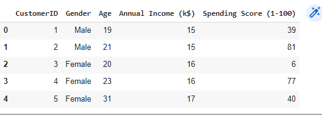
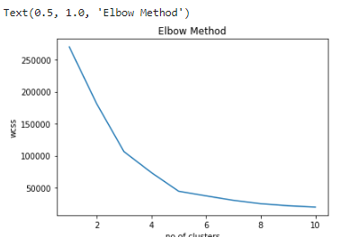
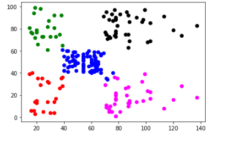

# Implementation-of-K-Means-Clustering-for-Customer-Segmentation

## AIM:
To write a program to implement the K Means Clustering for Customer Segmentation.

## Equipments Required:
1. Hardware – PCs
2. Anaconda – Python 3.7 Installation / Moodle-Code Runner

## Algorithm
```
1.Import pandas as pd .
2.Import matplotlib.plt.
3.From sklearn import kmeans cluster. 
4.Append kmeans,itertia.
5.Plot xlabel,ylabel.
6.Title as Elbow method.
7.Predict the y.
8.plot scatters for df0,1,2,3,4.
9.Give different colors.
10.Run the programme.
```
## Program:
```
/*
Program to implement the K Means Clustering for Customer Segmentation.
Developed by: V.NAVYA
RegisterNumber:  212221230069
*/
```
```
import pandas as pd
import matplotlib.pyplot as plt
df=pd.read_csv("/content/Mall_Customers.csv")
df.head()
df.info()
df.isnull().sum()
from sklearn.cluster import KMeans
wcss=[]
for i in range(1,11):
  kmeans=KMeans(n_clusters=i,init="k-means++")
  kmeans.fit(df.iloc[:,3:])
  wcss.append(kmeans.inertia_)
plt.plot(range(1,11),wcss)
plt.xlabel("no of clusters")
plt.ylabel("wcss")
plt.title("Elbow Method")
km=KMeans(n_clusters=5)
km.fit(df.iloc[:,3:])
y_pred=km.predict(df.iloc[:,3:])
df["cluster"]=y_pred
df0=df[df["cluster"]==0]
df1=df[df["cluster"]==1]
df2=df[df["cluster"]==2]
df3=df[df["cluster"]==3]
df4=df[df["cluster"]==4]
plt.scatter(df0["Annual Income (k$)"],df0["Spending Score (1-100)"],c='red',label="cluster0")
plt.scatter(df1["Annual Income (k$)"],df1["Spending Score (1-100)"],c='black',label="cluster1")
plt.scatter(df2["Annual Income (k$)"],df2["Spending Score (1-100)"],c='blue',label="cluster2")
plt.scatter(df3["Annual Income (k$)"],df3["Spending Score (1-100)"],c='green',label="cluster3")
plt.scatter(df4["Annual Income (k$)"],df4["Spending Score (1-100)"],c='magenta',label="cluster4")

```

## Output:

df.head()


df.isnull()


ELBOW METHOD


MATPLOTLIB.GRAPH



## Result:
Thus the program to implement the K Means Clustering for Customer Segmentation is written and verified using python programming.
